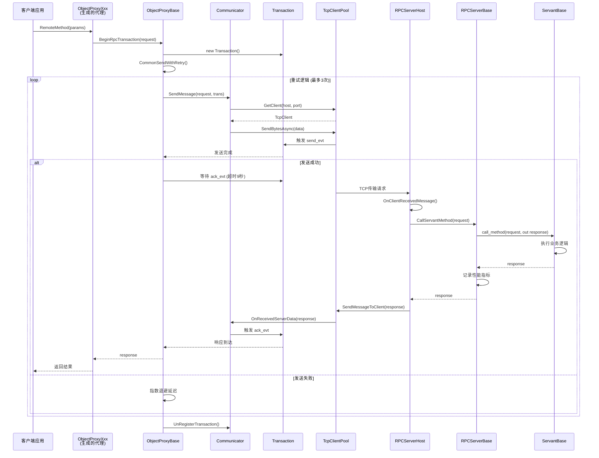
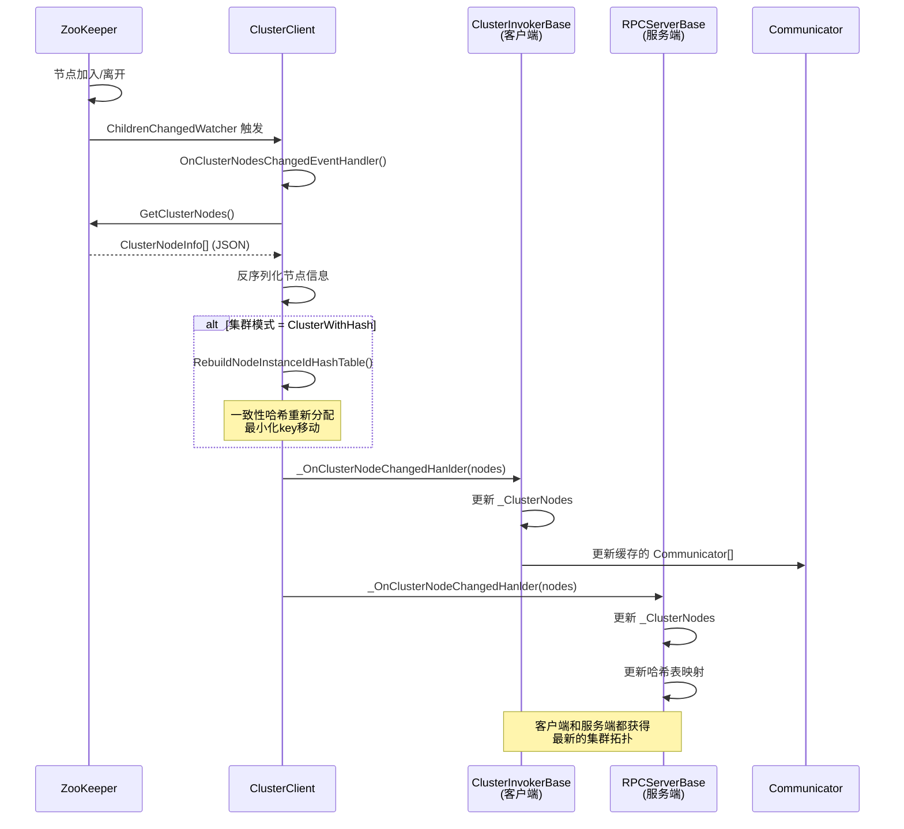
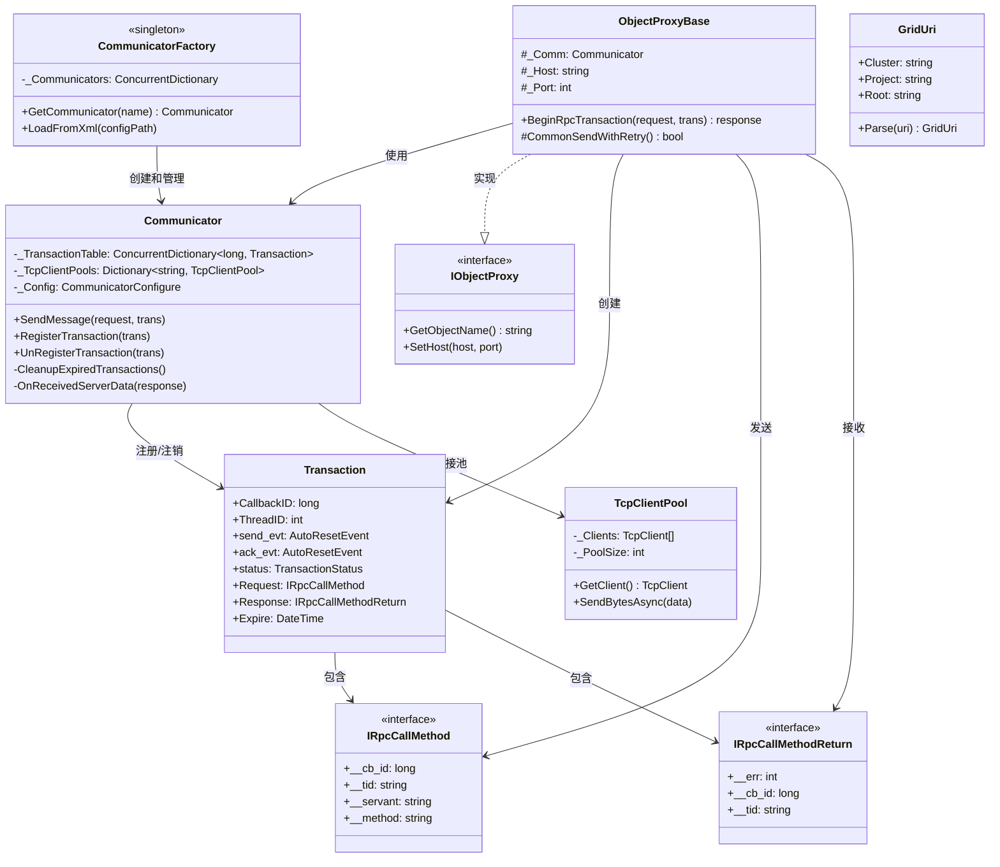
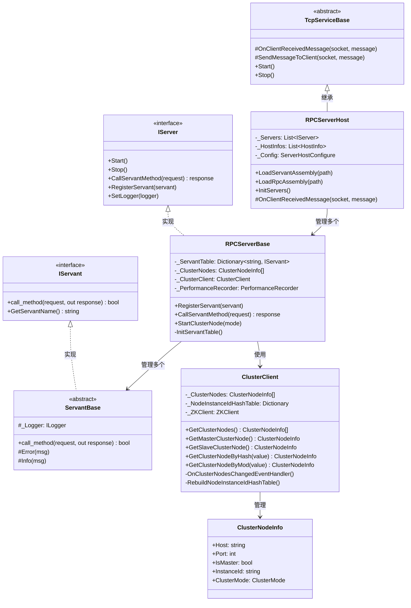
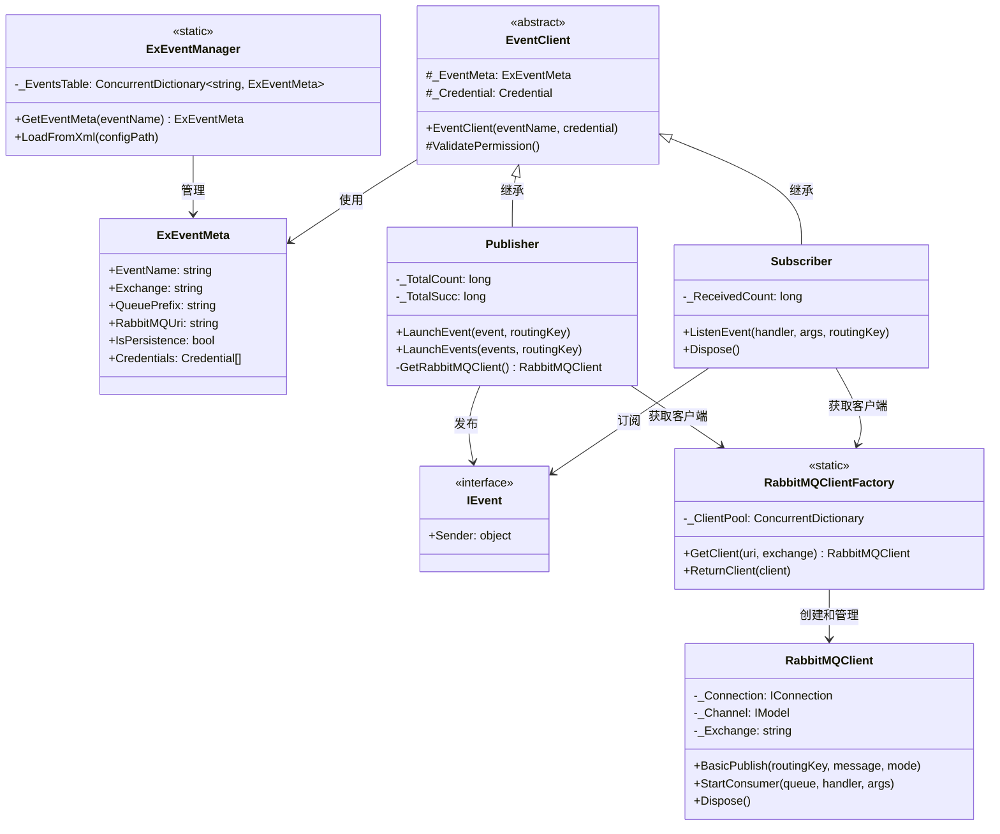
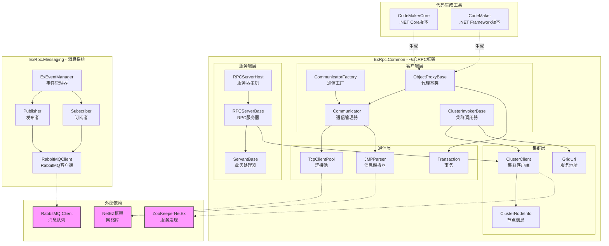
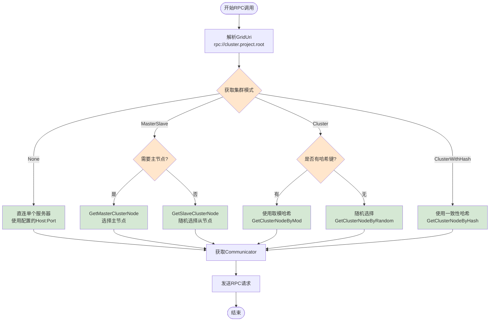
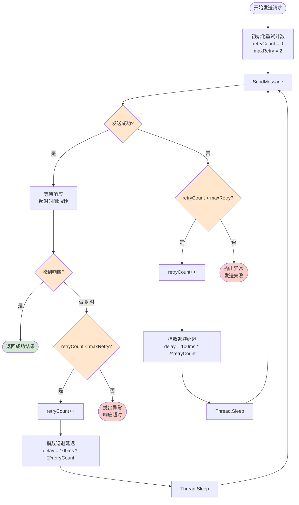
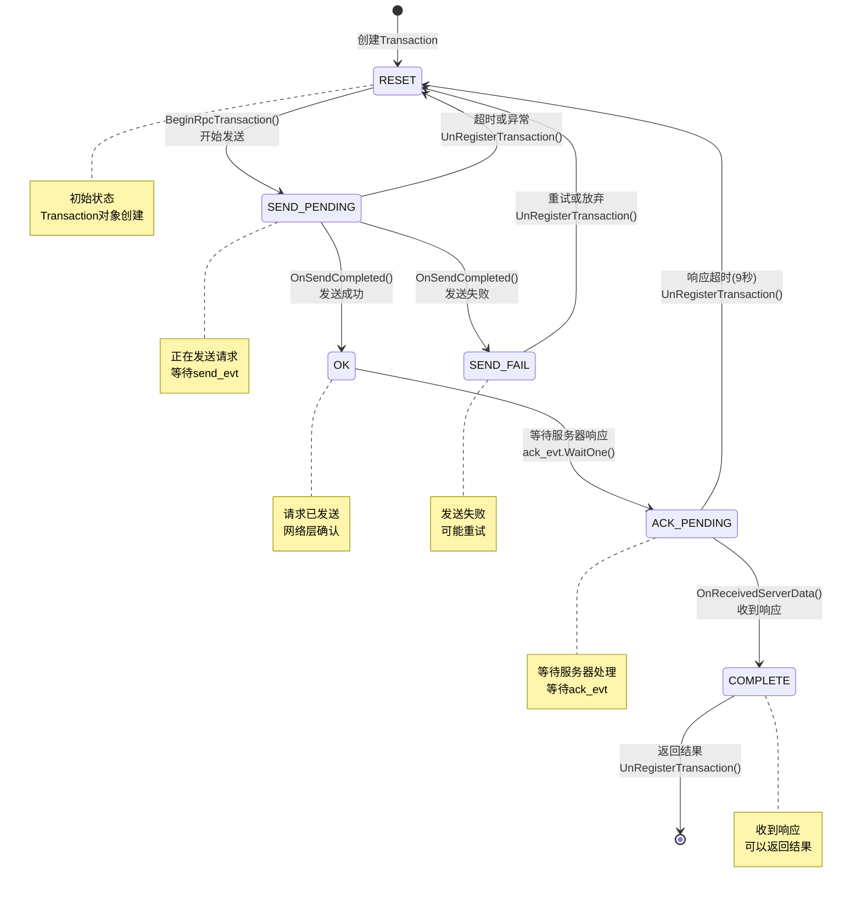
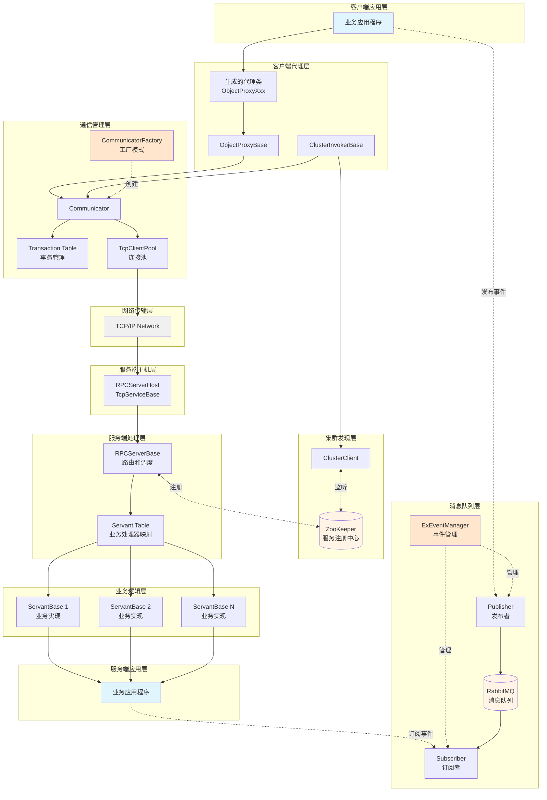

# ExRpc 架构图文档

本文档包含 ExRpc 框架的完整架构图，帮助理解各个类和组件在不同场景下的调用关系。

---

## 目录

1. [序列图 - 客户端RPC调用流程](#1-序列图---客户端rpc调用流程)
2. [序列图 - 集群节点变更流程](#2-序列图---集群节点变更流程)
3. [类图 - 核心通信架构](#3-类图---核心通信架构)
4. [类图 - 服务器端架构](#4-类图---服务器端架构)
5. [类图 - 消息事件架构](#5-类图---消息事件架构)
6. [组件图 - 模块依赖关系](#6-组件图---模块依赖关系)
7. [流程图 - 集群模式选择](#7-流程图---集群模式选择)
8. [流程图 - 重试逻辑](#8-流程图---重试逻辑)
9. [状态图 - Transaction状态机](#9-状态图---transaction状态机)
10. [架构总览图](#10-架构总览图)

---

## 1. 序列图 - 客户端RPC调用流程

展示从客户端发起远程调用到收到服务端响应的完整时序。

**关键点：**
- Transaction 管理整个请求的生命周期
- 支持重试机制（默认2次重试）
- 使用事件机制（send_evt、ack_evt）进行同步
- 超时时间可配置（默认9秒）

---

## 2. 序列图 - 集群节点变更流程

展示当 ZooKeeper 检测到集群拓扑变化时，系统如何响应和更新。

**关键点：**
- ZooKeeper 作为集群配置中心
- ClusterClient 负责监听和处理拓扑变化
- 一致性哈希在节点变化时自动重新平衡
- 客户端和服务端同步更新集群信息

---

## 3. 类图 - 核心通信架构

展示客户端通信层的核心类及其关系。

**关键关系：**
- `CommunicatorFactory` 单例模式管理 `Communicator` 实例
- `ObjectProxyBase` 依赖 `Communicator` 发送请求
- `Transaction` 封装请求/响应和同步事件
- `TcpClientPool` 管理TCP连接复用

---

## 4. 类图 - 服务器端架构

展示服务端处理请求的核心类及其关系。

**关键关系：**
- `RPCServerHost` 继承 `TcpServiceBase` 处理网络层
- `RPCServerBase` 实现 `IServer` 接口，管理 Servant
- `ServantBase` 实现 `IServant` 接口，执行业务逻辑
- `ClusterClient` 管理集群拓扑和节点选择策略

---

## 5. 类图 - 消息事件架构

展示基于 RabbitMQ 的发布/订阅消息系统。

**关键关系：**
- `ExEventManager` 单例管理事件元数据
- `EventClient` 作为发布者和订阅者的基类
- `RabbitMQClientFactory` 管理客户端连接池
- `Publisher` 和 `Subscriber` 通过 `RabbitMQClient` 与 RabbitMQ 交互

---

## 6. 组件图 - 模块依赖关系

展示 ExRpc 各个模块之间的依赖关系和职责划分。

**依赖说明：**
- **客户端层**：负责发起RPC调用和管理连接
- **服务端层**：负责接收请求和执行业务逻辑
- **集群层**：负责服务发现和负载均衡
- **通信层**：负责底层网络通信和消息解析
- **消息系统**：独立的发布/订阅事件系统
- **外部依赖**：ZooKeeper（集群）、RabbitMQ（消息）、NetEZ（网络）

---

## 7. 流程图 - 集群模式选择

展示根据 GridUri 和集群模式选择目标节点的决策逻辑。

**集群模式说明：**
- **None**：不使用集群，直连单个服务器
- **MasterSlave**：主从模式，读写分离，主节点处理写操作
- **Cluster**：多实例集群，使用取模或随机路由
- **ClusterWithHash**：一致性哈希，适合缓存等有状态服务

---

## 8. 流程图 - 重试逻辑

展示 ObjectProxyBase 中的重试机制和指数退避策略。

**重试策略：**
- **最大重试次数**：默认2次（可配置）
- **退避策略**：指数退避，避免服务器过载
- **延迟计算**：100ms × 2^retryCount
  - 第1次重试：100ms
  - 第2次重试：200ms
  - 第3次重试：400ms

---

## 9. 状态图 - Transaction状态机

展示 Transaction 对象在 RPC 调用过程中的状态转换。

**状态说明：**
- **RESET**：初始状态，Transaction 刚创建
- **SEND_PENDING**：正在发送请求到服务器
- **OK**：请求已成功发送，等待响应
- **SEND_FAIL**：发送失败，可能触发重试
- **ACK_PENDING**：等待服务器处理并响应
- **COMPLETE**：收到响应，调用完成

**事件机制：**
- `send_evt`：AutoResetEvent，等待发送完成
- `ack_evt`：AutoResetEvent，等待响应到达

---

## 10. 架构总览图

展示 ExRpc 框架的整体架构和各层次之间的关系。

**架构层次说明：**

1. **客户端应用层**：业务代码，调用远程服务
2. **客户端代理层**：自动生成的代理类，封装 RPC 调用
3. **通信管理层**：管理连接、事务、超时和重试
4. **集群发现层**：与 ZooKeeper 交互，获取服务节点列表
5. **网络传输层**：TCP/IP 网络通信
6. **服务端主机层**：监听端口，接收请求
7. **服务端处理层**：路由请求到具体的业务处理器
8. **业务逻辑层**：实际执行业务逻辑的 Servant
9. **服务端应用层**：业务代码，实现具体功能
10. **消息队列层**：独立的事件发布/订阅系统

**数据流向：**
- **RPC调用**：客户端 → 代理 → 通信器 → 网络 → 服务器 → Servant → 响应返回
- **集群发现**：ZooKeeper ← ClusterClient → 更新节点列表
- **事件消息**：发布者 → RabbitMQ → 订阅者

---

## 总结

### 核心设计模式

1. **工厂模式**：CommunicatorFactory、RabbitMQClientFactory
2. **单例模式**：ExEventManager、CommunicatorFactory
3. **对象池模式**：TcpClientPool、RabbitMQClientPool
4. **观察者模式**：ClusterClient 监听器、事件处理器
5. **模板方法模式**：ObjectProxyBase、ServantBase
6. **策略模式**：集群模式选择（Random、Hash、MasterSlave）
7. **代理模式**：ObjectProxyBase（动态代理生成）

### 关键技术特性

1. **并发安全**：ConcurrentDictionary 用于所有共享缓存
2. **异步处理**：Transaction 使用 AutoResetEvent 进行同步
3. **连接复用**：TcpClientPool 连接池（默认50个连接）
4. **自动重试**：指数退避策略，最大重试2次
5. **服务发现**：ZooKeeper 监听集群拓扑变化
6. **负载均衡**：支持4种集群模式
7. **性能监控**：PerformanceRecorder 跟踪调用耗时
8. **事务管理**：自动超时清理（默认60秒）

### 适用场景

- **微服务架构**：分布式服务间通信
- **集群部署**：多实例负载均衡
- **高并发场景**：连接池和异步处理
- **事件驱动**：RabbitMQ 解耦服务
- **服务发现**：ZooKeeper 动态拓扑管理

---

## 附录：快速参考

### 关键类速查

| 类名 | 职责 | 位置 |
|------|------|------|
| `Communicator` | 管理通信和事务 | ExRpc.Common |
| `ObjectProxyBase` | 客户端代理基类 | ExRpc.Common |
| `RPCServerBase` | 服务器基类 | ExRpc.Common |
| `ServantBase` | 业务逻辑基类 | ExRpc.Common |
| `ClusterClient` | 集群管理客户端 | ExRpc.Common |
| `Transaction` | RPC 事务 | ExRpc.Common |
| `Publisher` | 事件发布者 | ExRpc.Messaging |
| `Subscriber` | 事件订阅者 | ExRpc.Messaging |

### 配置文件速查

| 文件 | 用途 |
|------|------|
| `communicator.xml` | Communicator 配置（超时、重试、连接池） |
| `zookeeper.xml` | ZooKeeper 连接配置 |
| `rabbitmq.xml` | RabbitMQ 连接和事件配置 |
| `server.xml` | 服务器主机配置（端口、Servant） |

### 超时参数速查

| 参数 | 默认值 | 说明 |
|------|--------|------|
| ConnectTimeout | 200ms | TCP 连接超时 |
| SendTimeout | 3000ms | 发送请求超时 |
| WaitingACKTimeout | 9000ms | 等待响应超时 |
| TransactionExpire | 60s | 事务过期时间 |
| RetryCount | 2 | 最大重试次数 |
| ConnectionPoolSize | 50 | 连接池大小 |
